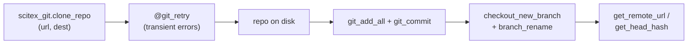

# scitex-git

<p align="center">
  <a href="https://scitex.ai">
    
  </a>
</p>

<p align="center"><b>Git operations and utilities — clone, init, branch, remote, retry decorator.</b></p>

<p align="center">
  <a href="https://scitex-git.readthedocs.io/">Full Documentation</a> · <code>pip install scitex-git</code>
</p>

<!-- scitex-badges:start -->
<p align="center">
  <a href="https://pypi.org/project/scitex-git/"></a>
  <a href="https://pypi.org/project/scitex-git/"></a>
  <a href="https://github.com/ywatanabe1989/scitex-git/actions/workflows/test.yml"></a>
  <a href="https://github.com/ywatanabe1989/scitex-git/actions/workflows/install-test.yml"></a>
  <a href="https://codecov.io/gh/ywatanabe1989/scitex-git"></a>
  <a href="https://scitex-git.readthedocs.io/en/latest/"></a>
  <a href="https://www.gnu.org/licenses/agpl-3.0"></a>
</p>
<!-- scitex-badges:end -->

---

## Installation

```bash
pip install scitex-git
```

## Architecture

```
scitex_git/
├── _clone.py          ← clone_repo, ls_remote, get_remote_url
├── _init.py           ← git_init, init_git_repo, find_parent_git
├── _commit.py         ← git_add_all, git_commit
├── _branch.py         ← checkout_new_branch, branch_rename, setup_branches
├── _remote.py         ← remote-URL helpers, head-hash queries
├── _retry.py          ← @git_retry decorator (transient-error backoff)
├── _validation.py     ← repo-state guards
├── _workflow.py       ← high-level multi-step flows
├── _vendor_sh.py      ← ~70-LOC subprocess wrapper (replaces scitex.sh)
└── _skills/           ← agent-facing skill pages
```

Pure-stdlib core. `_vendor_sh.py` is intentionally tiny so the package
has no `scitex.*` runtime dependency. The umbrella `scitex.git` import
resolves through a `sys.modules` bridge.

## 1 Interfaces

<details open>
<summary><strong>Python API</strong></summary>

<br>

```python
import scitex_git as sxg

# Clone / init
sxg.clone_repo(url, dest_dir)
sxg.git_init(repo_path)

# Add / commit
sxg.git_add_all(repo_path)
sxg.git_commit(repo_path, message="…")

# Branch
sxg.git_checkout_new_branch(repo_path, branch_name)
sxg.git_branch_rename(repo_path, old, new)
sxg.setup_branches(repo_path, template_name)

# Repo init / discovery
sxg.init_git_repo(project_dir, git_strategy="parent")
sxg.find_parent_git(project_dir)
sxg.create_child_git(project_dir)
sxg.remove_child_git(project_dir)

# Remote
sxg.get_remote_url(repo_path)
sxg.is_cloned_from(repo_path, url)
sxg.ls_remote(url)
sxg.get_head_hash(repo_path)

# Retry decorator
@sxg.git_retry(max_attempts=3)
def maybe_flaky_operation(): ...
```

</details>

## Demo



```python
>>> import scitex_git as sxg
>>> sxg.clone_repo("https://github.com/foo/bar", "./bar")
>>> sxg.git_add_all("./bar")
>>> sxg.git_commit("./bar", message="initial")
```

## Quick Start

```python
import scitex_git as sxg

sxg.clone_repo("https://github.com/foo/bar", "./bar")
sxg.git_add_all("./bar")
sxg.git_commit("./bar", message="initial")
```

## Status

Standalone fork of `scitex.git`. `scitex.logging.getLogger` is replaced by stdlib
`logging.getLogger`; the `scitex.sh.sh` shell wrapper is replaced by a tiny
~70-LOC `_vendor_sh.py` that supports just the call-shape used here. The
optional `scitex.writer.verify_tree_structure` validation step in
`create_child_git` is gated behind a `try/except` so it only runs when
`scitex-writer` is installed.

The umbrella package's `scitex.git` import path is preserved via a
`sys.modules`-alias bridge so existing code continues to work.

## Part of SciTeX

`scitex-git` is part of [**SciTeX**](https://scitex.ai). Install via
the umbrella with `pip install scitex[git]` to use as
`scitex.git` (Python) or `scitex git ...` (CLI).

>Four Freedoms for Research
>
>0. The freedom to **run** your research anywhere — your machine, your terms.
>1. The freedom to **study** how every step works — from raw data to final manuscript.
>2. The freedom to **redistribute** your workflows, not just your papers.
>3. The freedom to **modify** any module and share improvements with the community.
>
>AGPL-3.0 — because we believe research infrastructure deserves the same freedoms as the software it runs on.

## License

AGPL-3.0-only (see [LICENSE](./LICENSE)).

---

<p align="center">
  <a href="https://scitex.ai" target="_blank"></a>
</p>
